# ALUMNET

> Connecting university students and alumni through mentorship, professional networking, and events.

**[Launch the ALUMNET application](https://alumnetconnect.vercel.app/){:target="_blank"}**
[View the GitHub repository](https://github.com/cepdnaclk/e23-co2060-Alumnet){:target="_blank"}

> This page contains the project documentation. Use the **Launch** link above to open the actual web application.

## Project Overview

ALUMNET is a centralized, university-managed platform created to replace fragmented alumni engagement across email, social media and personal networks. It helps students find alumni with relevant experience, formalizes mentorship, supports direct communication and brings university events into one secure system.

## Main Features

- Secure registration, email verification, login and password recovery
- Separate student, alumni and administrator experiences
- Searchable alumni directory with academic and professional filters
- Mentorship requests, responses, tracking and mentor–mentee chat
- Student and alumni profile management
- Event creation, administrator approval, registration and reminders
- In-app notifications and configurable email notifications
- Administrative user verification and event moderation

## User Roles

### Students

Students can browse the alumni directory, review professional profiles, request mentorship, communicate with accepted mentors and register and participate for events.

### Alumni

Alumni can build professional profiles, respond to mentorship requests, guide mentees through chat and create events for the students and direct them for administrator approval.

### Administrators

Administrators verify accounts, manage users, review submitted events and monitor activity across the platform.

## User Interfaces

### Landing Page
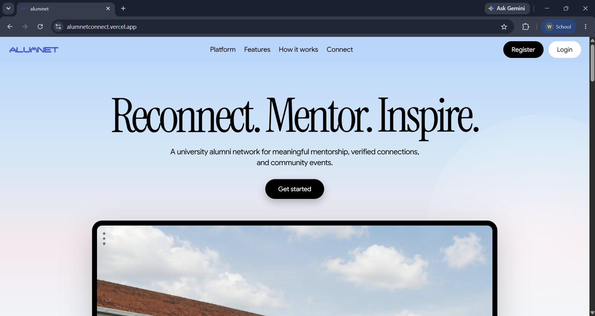

### Login and Registration

> Login page

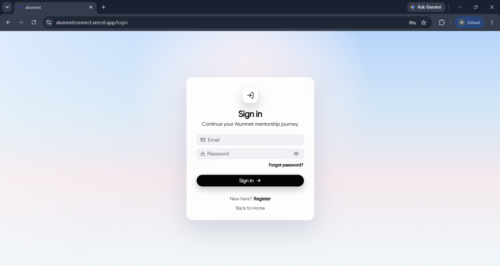

> Registration page

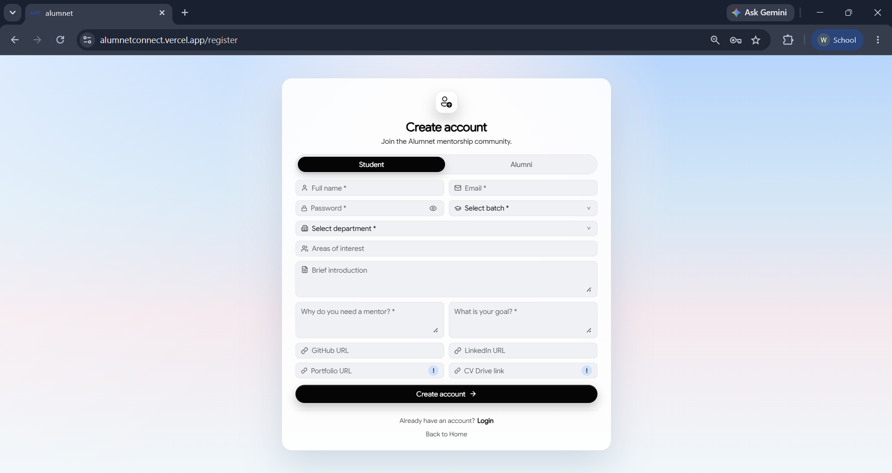

### Student Dashboard

> Home page for the students

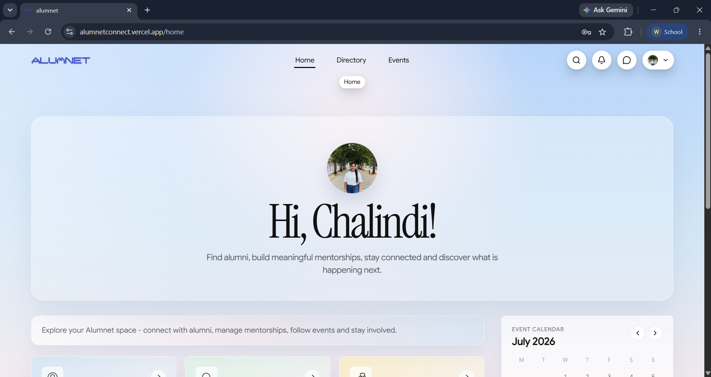

> Student dashboard page

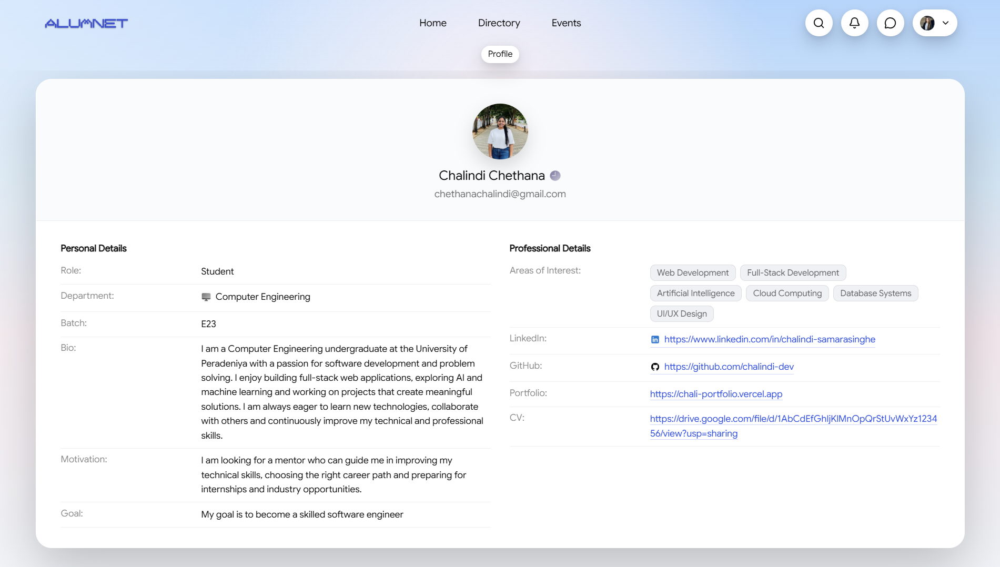

### Alumni Directory

> Searchable alumni directory

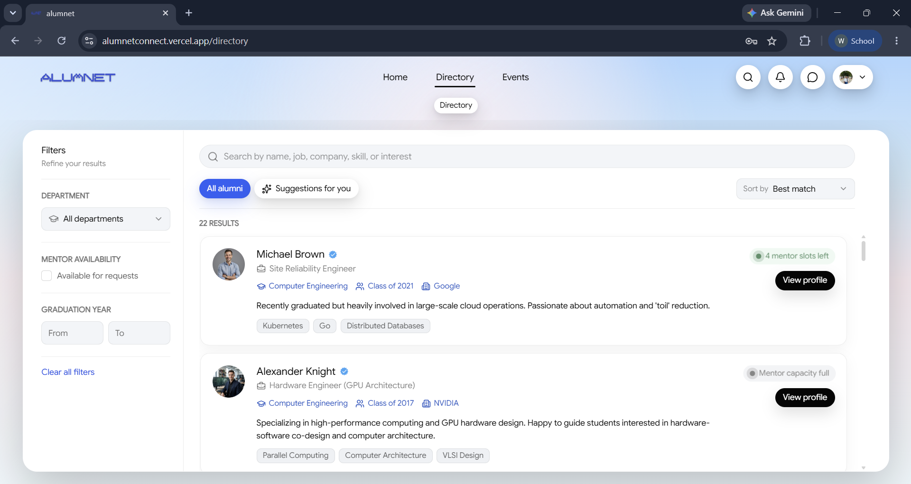

> Public alumni profile

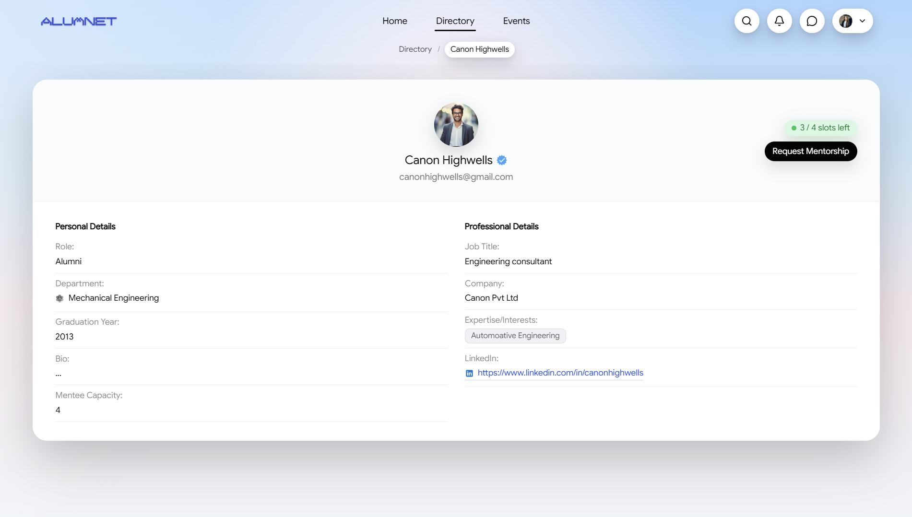

### Mentorship and Chat

> Mentorship request form

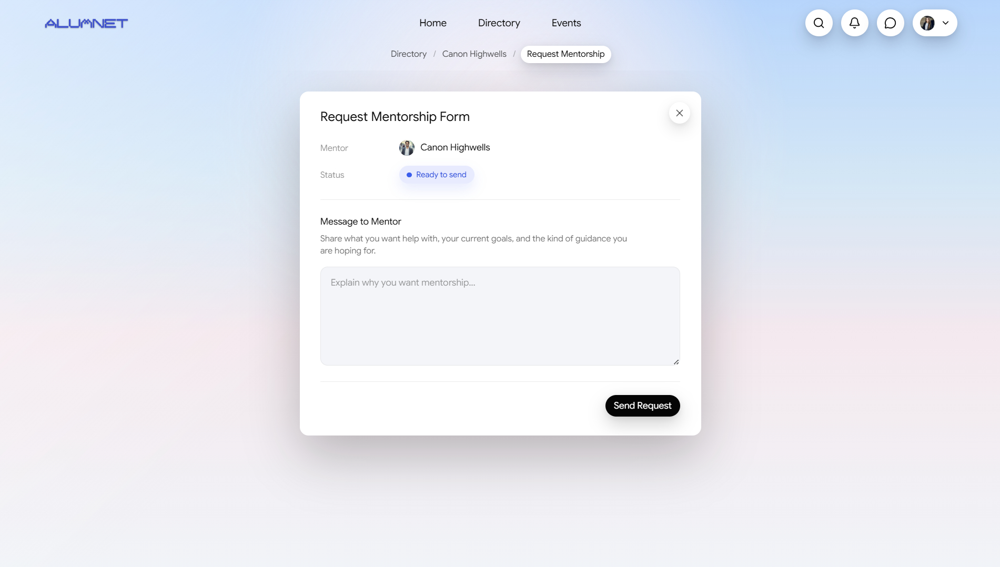

> Pending the conformation of the mentorship from the alumni side

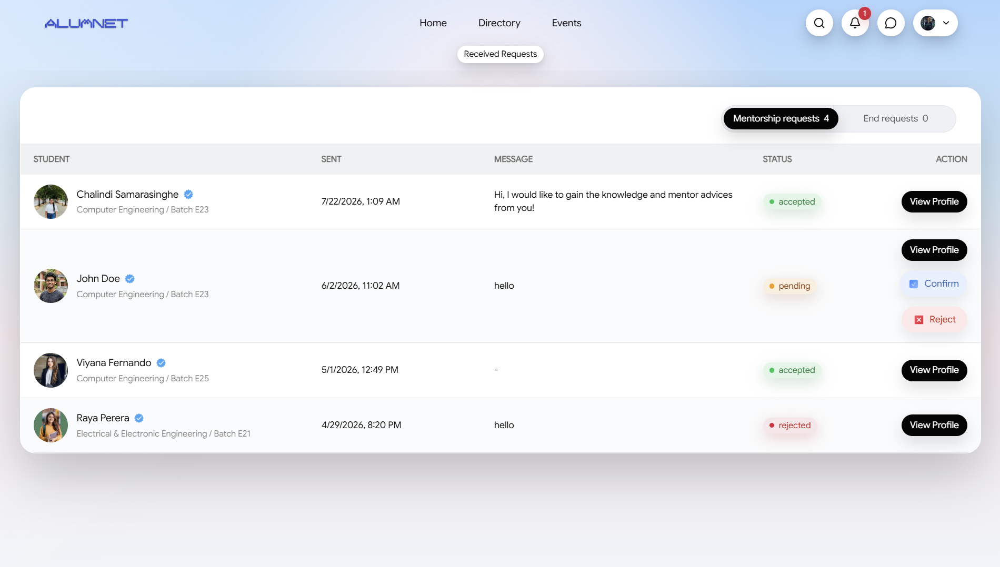

> Chat page

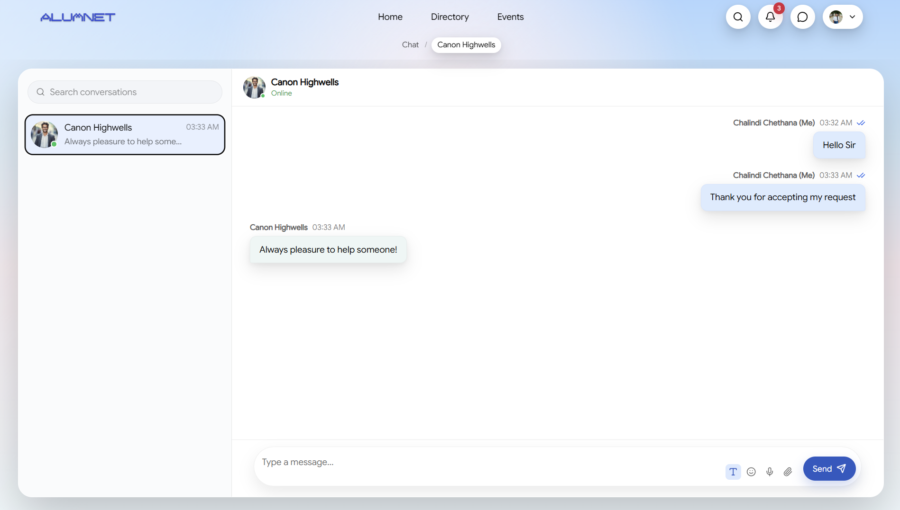

### Events

> Create event page

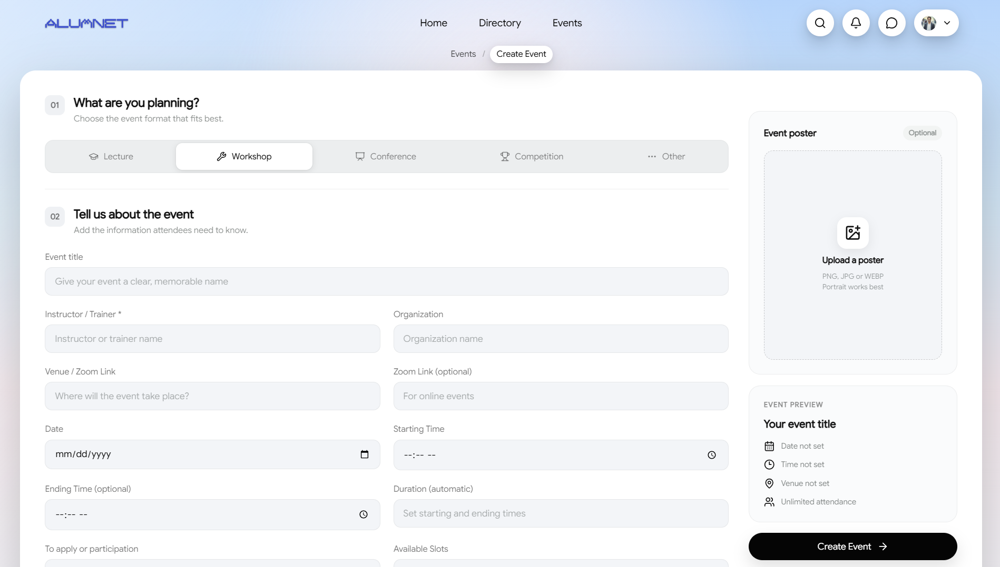

> Events page

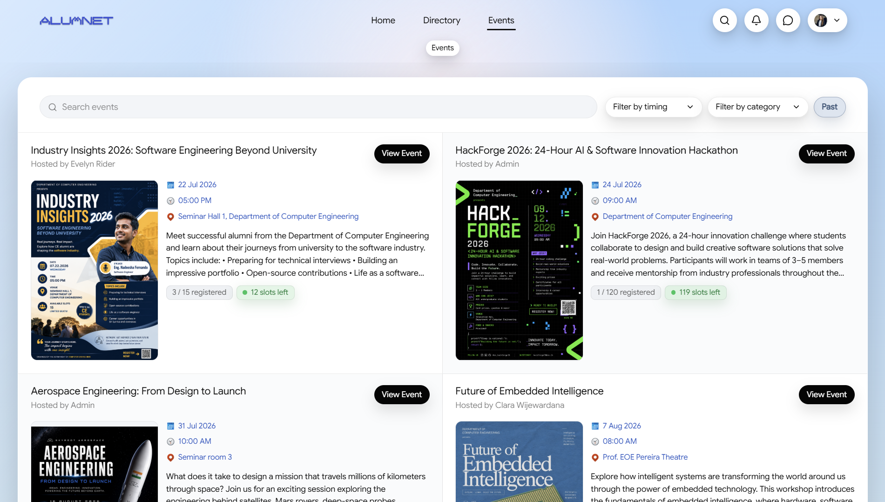

> Detailed event page

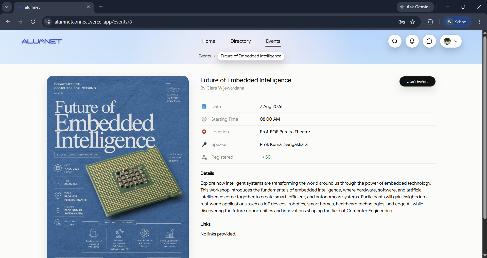

### Notifications

> Notification box

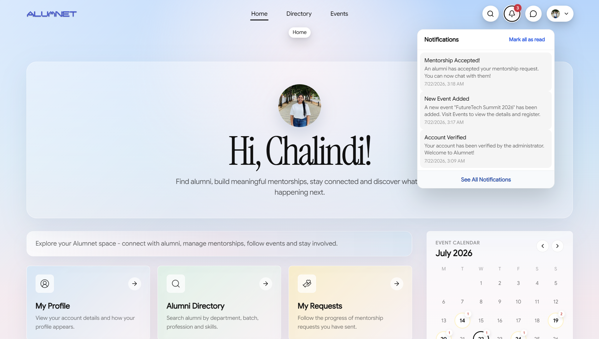

> Notification page

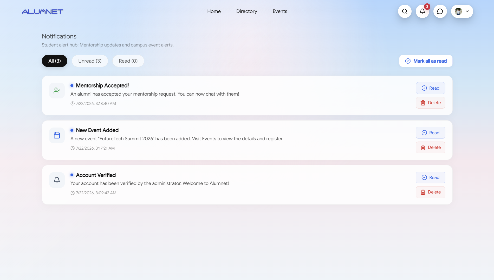

### Administrator Dashboard

> Home page for the Admins

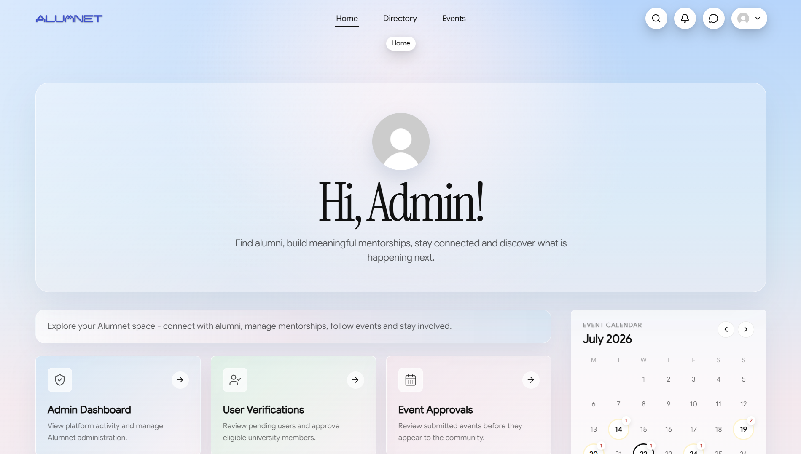

> Admin dashboard

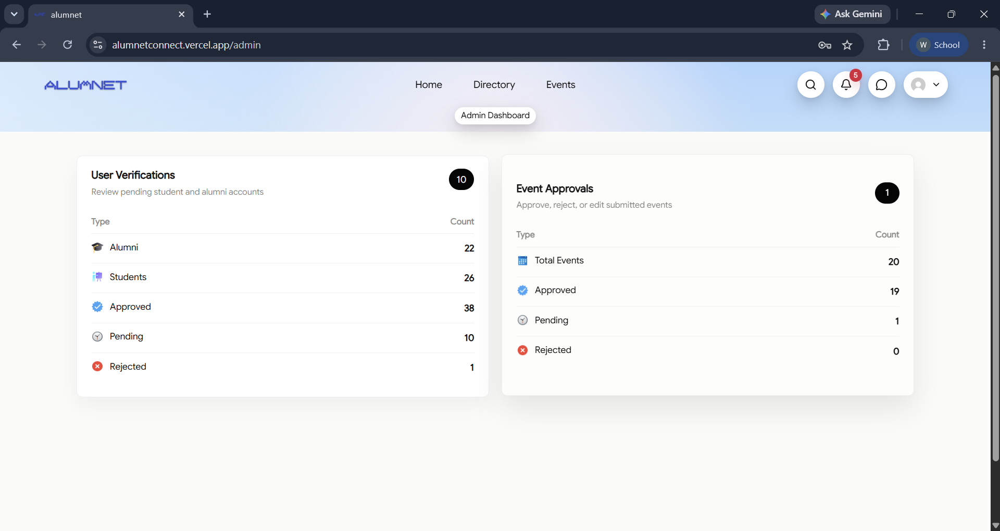

## System Architecture

ALUMNET follows a three-tier architecture:

1. **Presentation layer:** React and Vite deliver the responsive web interface.
2. **Application layer:** Node.js and Express provide REST APIs, business logic, and role-based authorization.
3. **Data layer:** PostgreSQL stores platform data, while Supabase Storage supports uploaded media.

JWT tokens protect private routes, bcrypt secures passwords, and Nodemailer supports account and notification emails.

## Database Design

The main data areas include users, student and alumni profiles, mentorship requests, mentor–mentee relationships, chat messages, events, event registrations, reminders, and notifications.

## Technology Stack

| Layer | Technologies |
| --- | --- |
| Frontend | React, Vite, React Router, Axios |
| Backend | Node.js, Express |
| Database | PostgreSQL |
| Authentication | JWT, bcrypt |
| Storage | Supabase Storage |
| Email | Nodemailer |

## Deployment

- **Frontend hosting:** Vercel
- **Backend hosting:** Railway
- **Database Media storage:** Supabase Storage

## Testing

The verification strategy covers functional workflows, API integration, role-based authorization, form validation, responsive behavior, and usability. Important end-to-end scenarios include registration and verification, mentorship request handling, chat access, event approval, event registration and notification delivery.

## Team CodeX

| Registration No. | Member | Email |
| --- | --- | --- |
| E/23/075 | K. K. Dilshara | [e23075@eng.pdn.ac.lk](mailto:e23075@eng.pdn.ac.lk) |
| E/23/340 | W. H. C. C. Samarasinghe | [e23340@eng.pdn.ac.lk](mailto:e23340@eng.pdn.ac.lk) |
| E/23/362 | S. N. V. N. Senadheera | [e23362@eng.pdn.ac.lk](mailto:e23362@eng.pdn.ac.lk) |
| E/23/435 | E. S. Wickramasinghe | [e23435@eng.pdn.ac.lk](mailto:e23435@eng.pdn.ac.lk) |

## Links

- [Live ALUMNET application](https://alumnetconnect.vercel.app/){:target="_blank"}
- [GitHub repository](https://github.com/cepdnaclk/e23-co2060-Alumnet){:target="_blank"}
- [Department of Computer Engineering](https://www.ce.pdn.ac.lk/){:target="_blank"}
- [University of Peradeniya](https://eng.pdn.ac.lk/){:target="_blank"}
